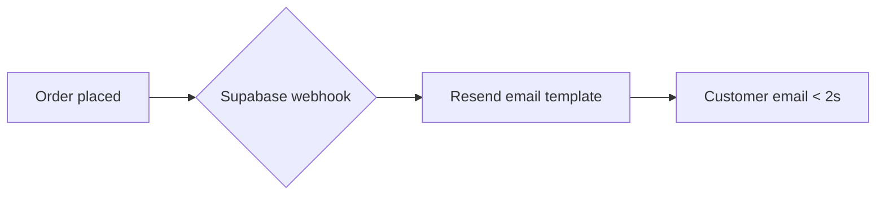

# career-memory/ — markdown store format

Source of truth. The push script parses YAML frontmatter; `type` decides the table.
Everything below the frontmatter (`---`) is the human narrative.

```
career-memory/
├── projects/<slug>.md                    # type: project
├── timeline/<slug>/<date>-<entry>.md     # type: work_entry
├── achievements/<slug>.md                # type: achievement (one file, list inside or per-file)
├── skills/<skill>.md                     # type: skill
└── weekly-reports/<week-start>.md        # type: weekly_report
```

## type: project — `projects/<slug>.md`
```markdown
---
type: project
slug: bombino
name: Bombino
repo_path: C:\Users\...\bombino
remote_url: git@github.com:onshore/bombino.git
status: active            # active | paused | shipped | archived
started_at: 2026-05-01
features:                 # named parts of the project
  - slug: admin-panel
    name: Admin Panel
  - slug: mail-automation
    name: Mail Automation
---
What the project is, who it's for, current state.
```

## type: work_entry — `timeline/<slug>/<date>-<entry>.md`
```markdown
---
type: work_entry
project: bombino
feature: mail-automation        # optional — ties the entry to a part of the project
occurred_on: 2026-06-11
title: Built transactional mail automation
source: [commit, transcript]    # commit | transcript | pr | todo | manual
source_ref: a1b2c3d             # sha / pr# / "manual"
significance: notable           # landmark | notable | standard — how powerful a read this is (see below)
skills: [next.js, supabase, resend]
files_changed: 12
context: "Manual order-confirmation emails were bottlenecking ops."
options_considered: "Resend vs SES vs Postmark — chose Resend for DX + speed."
decision: "Event-driven sends via Supabase webhooks → Resend templates."
rationale: "No cron, no missed sends, idempotent on order id."
foresight: "Anticipated duplicate-send risk; added idempotency key + retry cap."
outcome: "Zero manual emails; <2s delivery."
business_impact: "Removed ~5 hrs/wk of manual ops work; faster customer response."   # optional — cost/time/revenue/risk saved, with currency
---
## What I built
Order-confirmation emails now send **themselves** the moment a customer checks out — no one on the
team touches them anymore.

## Why it mattered
Ops was hand-sending every confirmation, which was slow and easy to forget. This removed a daily
manual task and made customers hear back in seconds.

## How it works

```
**The body AND the PM fields render as rich markdown with Mermaid diagrams in the app** — write for a
non-technical reader (headings, bold, bullets, a diagram when a flow helps). The
`context / options_considered / decision / rationale / foresight / outcome` fields are the
PM-showcase layer — critical thinking as structured data, not buried prose. `business_impact` is
optional and holds the concrete value (cost saved/added, time, revenue, risk) with currency, e.g.
`"Placid cost ~$39/mo (~₹4.5k/mo); now self-hosted at ~$0."` For `/worklog note`
entries (`source: [manual]`) these fields ARE the deliverable.

**`significance`** is the editorial weight of the entry — how powerful a read it is — and drives how
the app tiers it (featured cards for the standouts vs a flat ledger row). Judge it against the
project, not in absolute terms; most entries are `standard`.
- **`landmark`** — rare. A field-defining decision: a whole platform/system built, a vendor or
  paradigm replaced, hard business impact (real $/time figures), or the single best read in a project.
- **`notable`** — a strong read: real architectural judgment, a non-obvious trade-off, or meaningful
  impact worth surfacing above the rest.
- **`standard`** — a normal entry (the default). Incremental work, follow-ons, routine builds.

Aim for a pyramid per project: many `standard`, a few `notable`, at most one or two `landmark`. If
omitted, the column defaults to `standard`.

## type: achievement — `achievements/<slug>.md`
```markdown
---
type: achievement
project: bombino
feature: mail-automation     # optional
title: Cut order-confirmation latency to <2s
impact: "Removed a daily manual ops task; faster customer comms."
occurred_on: 2026-06-11
tags: [automation, reliability]
---
Context + what made this notable.
```

## type: skill — `skills/<skill>.md`
```markdown
---
type: skill
name: supabase
category: backend
---
Where/how I've used it, depth, evidence.
```

## type: weekly_report — `weekly-reports/<week-start>.md`
```markdown
---
type: weekly_report
week_start: 2026-06-08
week_end: 2026-06-14
highlights:
  - "Shipped Bombino mail automation"
  - "Onshore Studio landing flow"
---
Narrative summary of the week.
```
