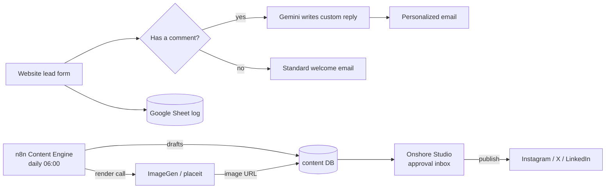

Onshore Labs' own internal automation — the systems that run the company's marketing and lead
handling without a person in the loop for the routine work. It spans two halves that share the same
n8n + Google + AI toolchain, captured here as features of one project (multiple repos):

**Lead handling (the OnShore Labs marketing site)**

- **Website Lead Automation (`lead-automation`)** — an n8n workflow triggered by the site's contact
  form. It logs every lead to a Google Sheet, decides whether the prospect left a message, and replies
  with the right email automatically — AI-personalized when they described their needs.
- **Branded Email Templates (`email-templates`)** — the dark-themed, mobile-responsive HTML emails
  (a standard welcome and an AI-personalized variant) prospects receive.

**Content generation + publishing (marketing content engine)**

- **ImageGen Platform (`placeit`)** — a self-hosted replacement for Placid (a paid image-templating
  service). It turns reusable templates + text into finished branded images via an API.
- **n8n Content Engine (`n8n-content-engine`)** — a scheduled automation that runs every morning,
  drafts the day's posts for Instagram / X / LinkedIn with an AI strategist + per-platform writers,
  calls ImageGen for the Instagram visual, and saves the drafts to a database.
- **Onshore Studio (`onshore-studio`)** — a web app where a person reviews those AI drafts, edits
  captions, approves or rejects them, and publishes the approved ones straight to the social platforms.

