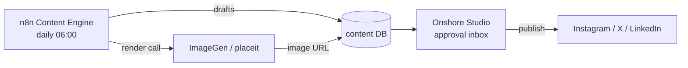

An end-to-end **marketing content automation system** for Onshore Labs: it writes daily social posts,
renders branded images for them, and gives a human a place to review, edit, approve, and publish — all
without a marketer touching a design tool or a copy doc.

Three parts work together:

- **ImageGen Platform (`placeit`)** — a self-hosted replacement for Placid (a paid image-templating
  service). It turns reusable templates + text into finished branded images via an API.
- **n8n Content Engine** — a scheduled automation that runs every morning, drafts the day's posts for
  Instagram / X / LinkedIn with an AI strategist + per-platform writers, calls ImageGen for the
  Instagram visual, and saves the drafts to a database.
- **Onshore Studio** — a web app where a person reviews those AI drafts, edits captions, approves or
  rejects them, and publishes the approved ones straight to the social platforms.

