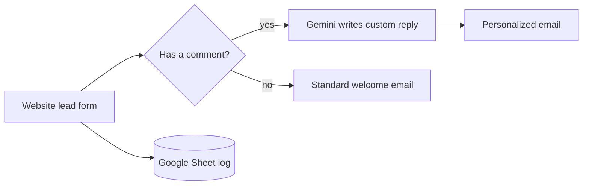

The **lead-capture system** behind the OnShore Labs marketing site. When someone fills out the
website contact form, this automation logs the lead, decides whether they left a message, and sends
back a polished, on-brand welcome email — personalized by AI when the prospect described their needs.

Two parts:

- **Website Lead Automation (`lead-automation`)** — an n8n workflow triggered by the site's lead
  form. It records every lead to a Google Sheet and replies with the right email automatically.
- **Branded Email Templates (`email-templates`)** — the dark-themed, mobile-responsive HTML emails
  (a standard welcome and an AI-personalized variant) that prospects receive.

