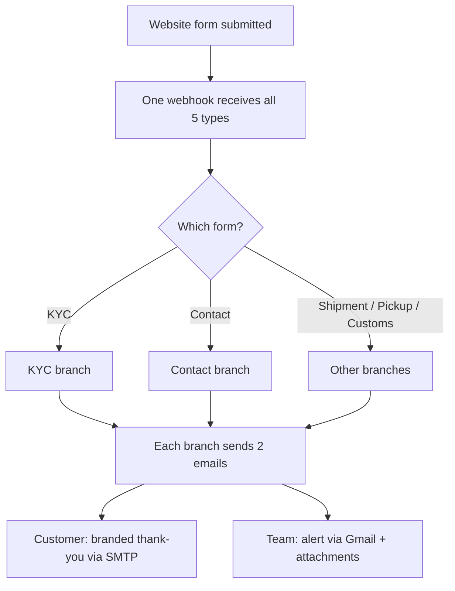

## What I built
When someone fills in a form on the Bombino website, **the reply now happens automatically**. The
customer instantly gets a branded "we got your request" email, and the team instantly gets an alert
with everything they need — no one has to watch a spreadsheet anymore.

## Why it mattered
Before this, every website inquiry was handled by hand off a CSV export. Customers waited in silence
and the team worked off outdated lists. This made the whole loop **instant and hands-free**.

## How it works
A single entry point receives all five form types, figures out which form it is, and sends a tailored
customer email plus an internal alert for each.

## The technical detail
Built as an **n8n workflow** ("Bombino Website Forms", id `7e09Bf86cV0lxh77`, synced via n8nac to
`website/workflows/onshorelabs/Bombino Website Forms.workflow.ts`). One webhook
(`/bombino-website-form`) ingests all types, a config node sets per-type subject lines, then an
If-chain routes by `body.type` (kyc / contact / pickup / customs / shipment fallthrough). Each branch
fires:

- **Customer acknowledgement** — branded HTML via SMTP (`donotreply@bombinoexp.com`)
- **Internal alert** — Gmail to `info@bombinoexp.com`, with full form data and any binary
  attachments (e.g. KYC ID proof) attached directly

Iterated heavily on **June 1** (many push/pull cycles against the n8n cloud instance, including some
400 errors and UI-vs-local sync conflicts while building the branches), refined further **June 6**,
and the final synced version went live **June 8**.
