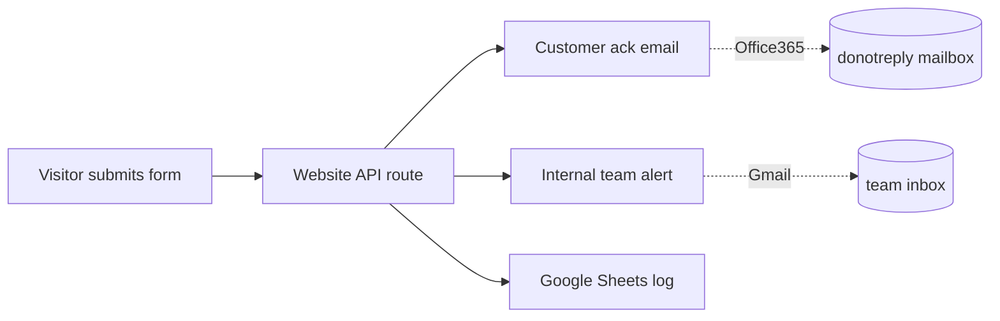

## What I built

The Bombino website has several forms — contact us, get a shipping quote, book a pickup, request
customs clearance, and submit KYC (identity documents). Until now, every time someone submitted one,
the website handed the data off to **n8n** — a separate "automation" tool running on its own server —
which then sent two emails: a friendly acknowledgement to the customer, and an alert to the Bombino
team's inbox.

I **removed that outside tool entirely** and rebuilt the email-sending directly inside the website's
own code.

## Why it mattered

- **One less thing to run and pay for.** n8n was a whole extra service to host and keep alive, just
  to send emails the website could send itself.
- **No more vendor lock-in.** The email logic now lives with the rest of the app.
- **Safer, clearer code.** Inside n8n, the email templates were written in a fragile "fill-in-the-blank"
  syntax with no safety checks — easy to break silently. Now they're normal, type-checked code that
  gets reviewed and versioned alongside everything else.

## How it works

A small email module holds **two separate mail accounts on purpose**: customer acknowledgements go out
from the company's `donotreply` address (Microsoft 365), while internal alerts come from a Gmail
account. Keeping them apart means a delivery problem with one can't knock out the other.

When a form comes in, the API route picks the right template, sends both emails, and logs to Google
Sheets — and if any one of those stumbles, the others still go through and the visitor still gets a
clean success response.

## What I was careful about

- **KYC file attachments** — the identity-document upload is attached straight to the team alert email,
  which n8n used to handle. Confirmed it works with a real file upload before shipping.
- **Didn't touch the neighbors** — that automation folder also holds two *other*, still-live workflows
  for OnShore Labs. I deleted only the dead Bombino one and left all the shared tooling alone.
- **Tested live, not just compiled** — fired real contact and KYC submissions against a running server
  and watched the emails actually send before merging.
