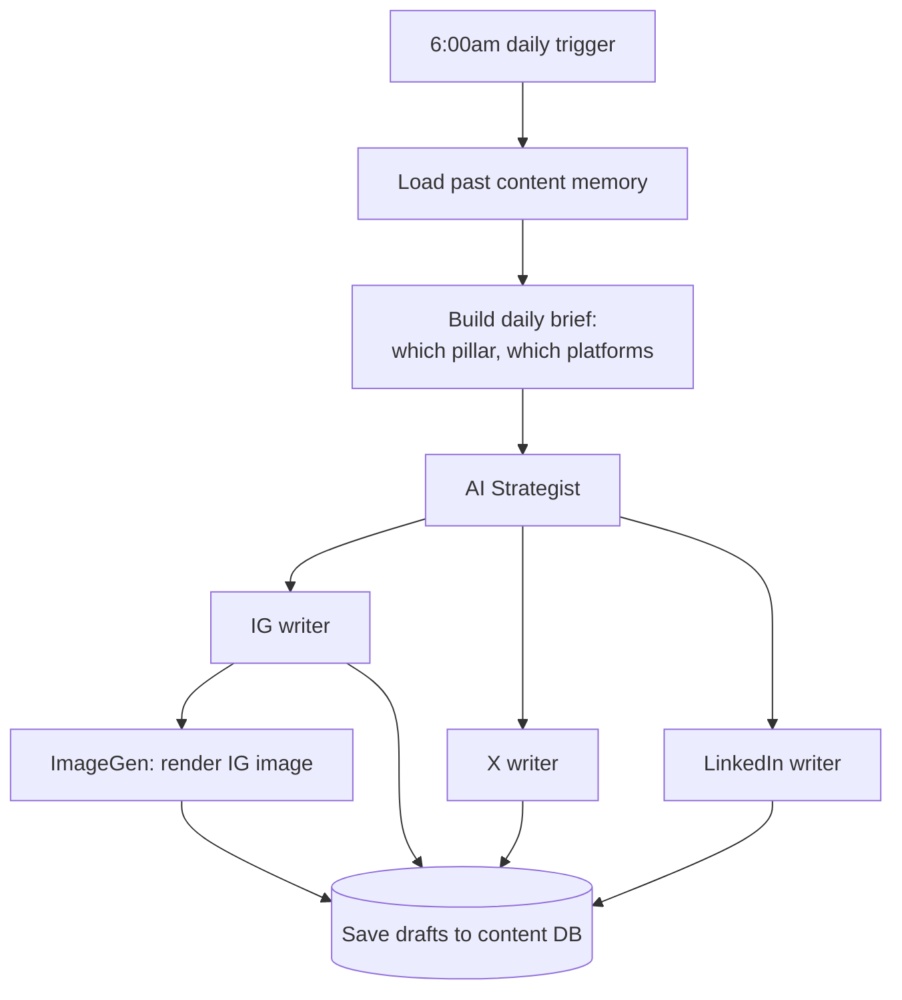

## What I built

An automation that **writes the company's daily social media posts by itself.** Every morning at 6am it
wakes up, thinks about what to post that day, drafts the copy for Instagram, X (Twitter), and LinkedIn —
each in that platform's own voice — generates the Instagram image, and saves everything as drafts for a
human to review.

It runs on **n8n** (a visual automation tool), but I built it **as code** — the entire workflow is a file
in our codebase, so it can be reviewed, versioned, and restored, instead of being a fragile diagram that
only exists in a browser.

## Why it mattered

- **No one has to write posts from scratch every day.** The hard part — coming up with the angle and
  drafting platform-appropriate copy — happens automatically.
- **Each platform sounds right.** Instead of one generic post copy-pasted everywhere, a separate AI
  "writer" handles each channel's style.
- **It's safe by design.** The automation only *drafts* — nothing is published until a person approves it
  in the Studio app.

## How it works

A **strategist** AI decides the day's theme, then hands off to **per-platform writers**. The Instagram
post also gets a branded image rendered by our own ImageGen service. Everything lands in a database as
drafts.

## What I was careful about

- **Dropped the paid image service.** The Instagram image step now calls our own ImageGen API, not
  Placid — one less bill and one less outside dependency in the daily run. See [[placeit-imagegen-platform]].
- **A posting calendar, on purpose.** Not every platform posts every day — LinkedIn skips Wednesdays, for
  example. On the very first live run, LinkedIn was (correctly) empty because it was a Wednesday — by
  design, not a failure.
- **Flagged the security debt out loud** — a shared database key and a default API key on a public
  endpoint both need rotating before this is truly production-hardened.

Feeds drafts to [[onshore-studio-approval-and-publishing]] for human review and publishing.
