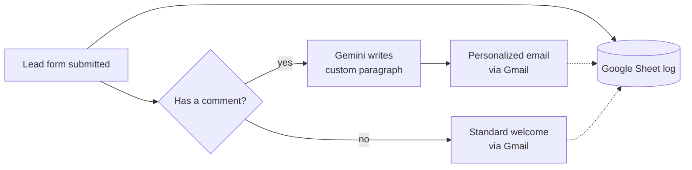

## What I built

An automation that answers website leads **by itself**. When someone fills out the OnShore Labs
contact form, they instantly get a branded welcome email — and if they wrote a message describing
what they need, an AI reads it and writes a short, personal reply tailored to their situation. No one
on the team has to touch it.

## Why it mattered

Before this, every lead got the **same generic email**, even the ones who carefully explained their
problem. That's a missed first impression with exactly the prospects most worth impressing. Now the
people who engage the most get a reply that actually speaks to *their* problem — automatically, in
seconds, around the clock.

## How it works

The workflow runs in **n8n** (a visual automation tool — think of it as wiring apps together with no
code). It branches on one simple question: *did the lead leave a comment?*

- **Yes** → a **Google Gemini** AI agent reads the comment and writes a warm 2-3 sentence paragraph
  acknowledging their problem and how OnShore can help. That paragraph is dropped into a dedicated
  HTML email (`email-template-custom-message.html`) and sent via **Gmail**.
- **No** → they get the standard branded welcome (`email-template-main.html`).

Either way, the lead is appended to a **Google Sheet** so nothing slips through.

Both emails share a dark, mobile-responsive design (Space Grotesk + Inter, aqua accents, service
cards, founder QR code) so every reply looks unmistakably OnShore.
