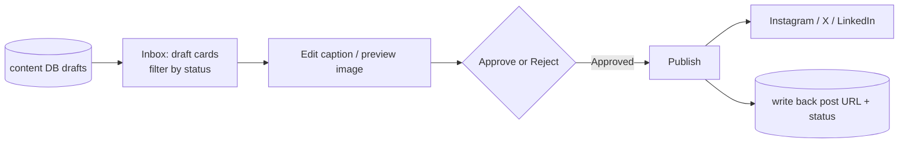

## What I built

**Onshore Studio** — the web app where a human takes control of the AI's daily drafts. The content
engine writes posts automatically, but a person should always have the final say. Studio is that final
say: an **inbox of draft posts** where you can read each one, edit the caption, see the Instagram image,
and then **approve, reject, or publish** it — and publishing sends it straight to Instagram, X, and
LinkedIn from this one screen.

## Why it mattered

- **One place to control everything.** Instead of logging into three social platforms, the reviewer
  works from a single inbox.
- **Nothing goes out unchecked.** Every AI draft passes through a human's approve/reject before it can be
  published.
- **One post, not three fragments.** The engine writes a separate row per platform; Studio stitches them
  back into a single card so you review the *idea*, not disconnected pieces.

## How it works

The app reads the drafts the [[n8n-content-engine]] saved, groups the per-platform rows into one card,
and lets the reviewer edit and decide. Approving unlocks **Publish**, which calls each social platform's
API and records the live post's link back into the database.

## What I was careful about

- **Ships before the keys do.** Every social-media credential is optional — if one's missing, you get a
  tidy "not configured" message instead of a crashed app, so it runs today and the tokens get pasted in
  later.
- **Publish is a one-way gate.** Only an *approved* post can be published, and publishing writes back the
  real post id and URL — an audit trail of what actually went live.
- **Reused proven security.** Login and the locked-down database access were copied from the already-
  hardened ImageGen app rather than reinvented — see [[placeit-imagegen-platform]].
- **Designed to a spec, on a phone.** Playfair + Montserrat type, teal-on-dark, sharp edges, and a
  layout that works on a phone screen.
