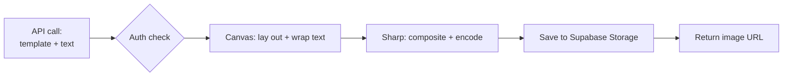

## What I built

A **self-hosted replacement for Placid** — Placid is a paid online service that turns a design template
plus some text into a finished image (think: "headline goes here, hook goes here," and out comes a
branded social graphic). Instead of renting that, I built our own.

It has three pieces:

- A **template editor** — a visual canvas where you place text and image "layers" on a base image,
  drag and resize them, and set fonts, colors, alignment.
- A **rendering engine** — give it a template and the actual words, and it produces the final PNG/JPEG.
- An **API** — our automation sends a web request with the text, and gets back a finished image URL.

## Why it mattered

- **No per-image bill, no outside dependency.** Every image the content system makes used to cost money
  and rely on someone else's servers. Now it's ours.
- **The template *is* the contract.** Each layer has a name (e.g. `headline`, `hook`). The automation
  just fills those names in — so when a designer edits the template, the automation keeps working with
  no code change.

## How it works

A **canvas** library handles the hard part — wrapping text, auto-shrinking it to fit, aligning it — and
then **Sharp** stacks the layers and saves the final image. The two split the job because neither can do
it alone: canvas can't encode fast, Sharp can't lay out text.

## What I was careful about

- **Built for the cloud from day one** — Vercel (where it's hosted) has no permanent disk, so every
  image and asset is stored in Supabase Storage, not on the machine.
- **Won't fall over under load** — a queue limits how many images render at once and politely returns
  "too busy" (429) instead of crashing. Tested with 20 at once: zero failures.
- **Locked-down database** — the data is sealed behind row-level security with a server-only key; the
  public key can't read or write anything.
- **Chased down an invisible font bug** — Google Fonts split into language "subsets," and the first one
  (Cyrillic) has no English letters, which silently rendered as blank boxes. Fixed it to always grab the
  Latin set.

Related: feeds [[n8n-content-engine]] and shares the locked-down Supabase pattern used across the system.
