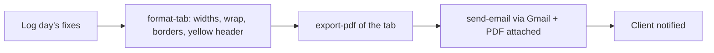

## What I built

The task-logging skill can now **email the client a finished report by itself**. After the day's
fixes are written into the Google Sheet, it exports that day's tab as a **PDF**, writes a short
summary, and sends it as an email — replacing the manual "it's done" WhatsApp message. It also
**styles every report tab automatically** so they all look the same and print cleanly.

## Why it mattered

Logging the fixes was only half the job — someone still had to tell the client and tidy the sheet
by hand. Now the whole loop is one step: log → format → email with the PDF attached. Less manual
work, fewer mistakes, and a tidier, more professional report going out.

## How it works

## The fiddly bits

- **Email auth reused the existing Google login** (Gmail send scope added) — no new service or key.
- **Wrong-profile login** was a real snag: the browser kept opening the wrong Google account, so it
  now prints the sign-in link and forces the account chooser.
- **Formatting order matters** — styling runs *after* the rows are added, so borders and text-wrap
  actually cover the data, not just an empty template.
- **A stray full-width yellow header** (it bled across the whole row) is now clamped to columns A–C,
  so the printed report looks right.
