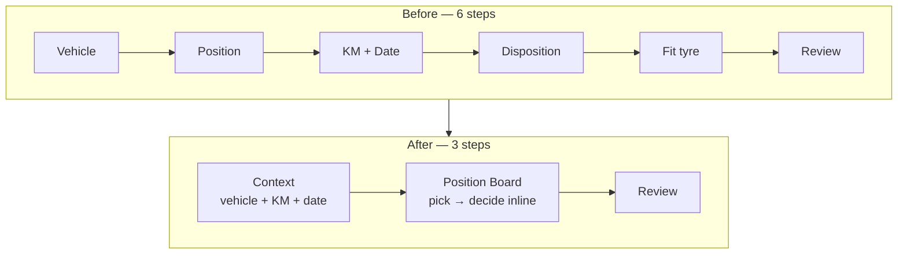

## What I built
Recording a single tyre change used to walk staff through **six** separate screens. I rebuilt it so
the same job takes **three**. Same information captured, same safety checks — half the back-and-forth.

A "tyre change" here just means: a worn tyre comes off a truck or trailer at a specific wheel
position, and a new (or reused) one goes on. Staff log this on the shop floor, often on a phone.

## Why it mattered
The six-screen walk was the biggest source of friction in the app. The screens weren't six real
decisions — they were three decisions split across six pages, which made staff re-orient to the same
truck and the same wheel positions over and over. Cutting it to three matches the screens to how
people actually think about the task.

## Before → after

## How it works
- **Step 1 — Context:** the vehicle list expands inline; selecting a truck/trailer reveals KM and
  date right there, so "what + when" is one action instead of two screens.
- **Step 2 — Position Board:** a single screen with two phases — **Phase A** picks the wheel
  positions, **Phase B** collects the removed-tyre disposition (reuse pile vs trash) and the
  fitted-tyre source for each picked position, without leaving the board. The position context is
  built once and reused, so staff don't re-orient three times.
- **Step 3 — Review:** confirm the whole change and submit via the existing `record_tyre_change`
  Supabase RPC.

All of it runs off one `useReducer` state machine (`step` 1–3, `phase` A/B) in
`change-page-client.tsx`, keeping the existing per-position validation — tyre-size derivation,
brand-required-on-reuse, and KM-not-below-last-recorded — fully intact.
